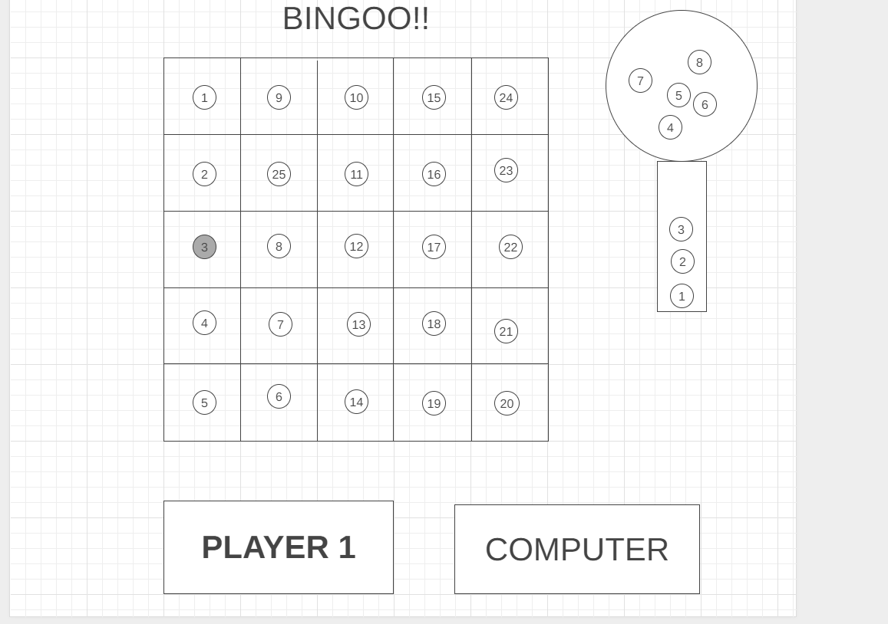
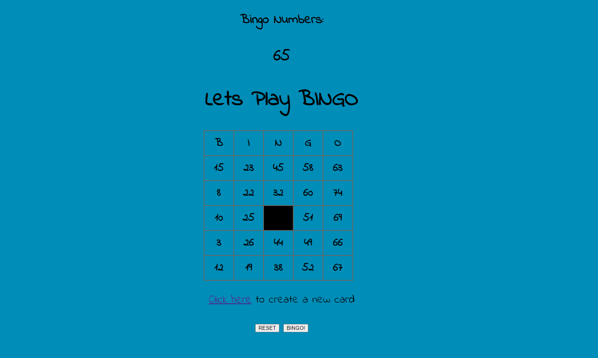

 ## bingo-project

## Objective:
-create a browser-based game usig HTML, CSS, JS

## MOTIVATION:
During highscool bingo was my favorite game to play when we had time in class or some free time to do so, my friends and i used to play it a lot and i decided why not to make one.

to play the game:
click [here](https://bingo-webgame.surge.sh/).

Here is my initial wire-frame of how the game should looks like:
## WireFrame:

## Here is how my game looks like:

 ## Technology used :
 HTML
 CSS
 JavaScript
 Surge
 GIT
 

## BINGO
1. GAME START BY A 5X5 GRID WITH NUMBER IN EACH CELL FROM 1 TO 100  RANDOMLY PLACED 
2. BIG BALL CONTAINING ALL THE BALLS FOR EACH NUMBER  
  .1 PICK A NUMBER RANDOMLY
  
3. EACH NUMBER WILL BE USED TO COMPARE THE GRID THAT WE HAVE AND TO COMPLETE THAT SQUARE OF NUMBER 
   1.IF PLAYER COMPLETE A FULL ROW 
ANNOUCE BINGO
   2.IF PLAYER COMPLETE A COLUMN 
ANNOUCE BINGO 
4. WHOEVER FINISH A ROW OR COLUMN FIRST AND ANNOUCE BINGO FIRST WINS

## Minimum Viable Product:
- As a user, i should be able to refresh the poage and new numbers will show up on the screen 
- as a user i should be able to see the  numbers on the screen  
- As a user i should be able to press on a number in the table and highlght thew umber chosen
- As a user if winning conditons are met, it's a BINGO!
- reset top refresh the page 
## Stretch Goals:
- [x] add a ball that display all the number at a time 
- [ ] add an accurate winning condition, if wrong numbers pressed display "BAD BINGO"
- [ ] add a play/pause button and a button to press whenever the user wants the numbers to be shown
- [ ] fix the CSS and more styling to it with sounds and images
- [x] fix my code so it can work properly
- [ ] add mobile responsive 
- [ ] add a computer player to compete with the user
